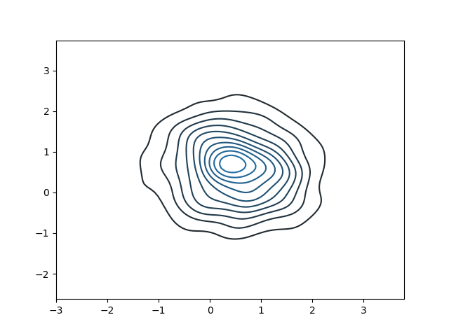

# About

A chainer implementation of [On the Anatomy of MCMC-based Maximum Likelihood Learning of Energy-Based Models](https://arxiv.org/abs/1903.12370).

## Example

## Reference

- [On the Anatomy of MCMC-based Maximum Likelihood Learning of Energy-Based Models](https://arxiv.org/abs/1903.12370)
